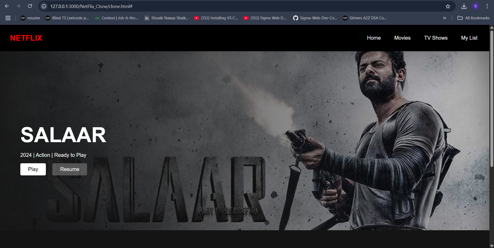

# NetFlix_Clone
## Date: 09-07-2025
## Objective:
To create a modern, responsive navigation bar using CSS Flexbox, mimicking real-world websites like Netflix. This helps reinforce alignment, spacing, and layout structuring using Flexbox properties.

## Tasks:

#### 1. Structure the HTML Layout:
Use a ```<nav>``` tag as the main container.

Add a brand logo/title on the left using a ```<div> or <h1>```.

Add navigation links like Home, Menu, About, Contact, and Login using a ```<ul> with <li> and <a>```.

#### 2. Apply Flexbox for Layout:
Use display: flex on the ```<nav>``` container.

Use justify-content: space-between to align the logo and menu.

Use align-items: center to vertically center both sections.

Style list items with horizontal spacing using gap or margin.

#### 3. Style Like a Real-World Navbar:
Add background color (e.g., dark or gradient like Netflix/Zomato).

Style text with bold fonts, hover effects, and link styling.

Remove default ul and li styles (list-style: none, text-decoration: none).

#### 4. Bonus Enhancements:
Add a hover underline or button effect on links.

Make it responsive using flex-wrap or media queries.

Fix the nav bar to top with position: sticky.
## HTML Code:
```html
<!DOCTYPE html>
<html lang="en">
<head>
  <meta charset="UTF-8" />
  <meta name="viewport" content="width=device-width, initial-scale=1.0"/>
  <title>Netflix Clone</title>
  <link rel="stylesheet" href="styles.css"/>
</head>
<body>


  <nav class="navbar">
    <div class="left-section">
      <div class="logo">NETFLIX</div>
      
    </div>
    
    <ul class="nav-links">
      <li><a href="#">Home</a></li>
      <li><a href="#">Movies</a></li>
      <li><a href="#">TV Shows</a></li>
      <li><a href="#">My List</a></li>
    </ul>

    
  </nav>

 
<section class="hero">
  <div class="hero-content">
    <h1>SALAAR</h1>
    <p>2024 | Action | Ready to Play</p>
    <div class="hero-buttons">
      <button class="play-btn"><i class="fa fa-play"></i> Play</button>
      <button class="resume-btn">Resume</button>
    </div>
  </div>
</section>

  
  <section class="movie-list">
    <h2>Popular Shows This Week</h2>
    <div class="movie-thumbnails">
      <div class="movie-card">
        
        <p>Salaar</p>
      </div>
      <div class="movie-card">
        
        <p>Pushpa 2</p>
      </div>
      <div class="movie-card">
        
        <p>Hari Hara Veera Mallu</p>
      </div>
    </div>
  </section>

  
</body>
</html>

```
## CSS Code:
```css
body {
  margin: 0;
  font-family: Arial, sans-serif;
  background: #141414;
  color: white;
}


.navbar {
  display: flex;
  justify-content: space-between;
  align-items: center;
  background-color: #000;
  padding: 1rem 2rem;
  position: sticky;
  top: 0;
  z-index: 1000;
}

.left-section {
  display: flex;
  align-items: center;
  gap: 0.6rem;
}

.logo {
  font-size: 1.5rem;
  font-weight: bold;
  color: red;
}

.date {
  color: #ccc;
}

.nav-links {
  display: flex;
  list-style: none;
  gap: 2rem;
}

.nav-links a {
  position: relative;
  color: white;
  text-decoration: none;
  padding: 5px;
  transition: 0.3s ease-in-out;
}

.nav-links a::after {
  content: "";
  position: absolute;
  bottom: 0;
  left: 0;
  height: 2px;
  width: 0%;
  background: red;
  transition: width 0.3s;
}

.nav-links a:hover::after {
  width: 100%;
}


.my-list:hover {
  color: #e50914; 
  font-weight: bold;
  text-shadow: 0 0 5px #e50914;
}

.right-section {
  display: flex;
  gap: 1rem;
  align-items: center;
}

.profile-pic {
  width: 32px;
  height: 32px;
  border-radius: 50%;
}


.hero {
  background-image: url('salaar.jpg');
  background-size: cover;
  background-position: center;
  height: 80vh;
  display: flex;
  align-items: center;
  padding-left: 4rem;
  position: relative;
  transition: transform 0.5s ease-in-out;
}

.hero::after {
  content: '';
  position: absolute;
  top: 0;
  left: 0;
  width: 100%;
  height: 100%;
  background: linear-gradient(to right, rgba(20,20,20,0.95), rgba(20,20,20,0.2));
  transition: background 0.3s ease;
  z-index: 1;
}

.hero:hover {
  transform: scale(1.02);
}

.hero:hover::after {
  background: linear-gradient(to right, rgba(10,10,10,0.95), rgba(10,10,10,0.4));
}

.hero-content {
  position: relative;
  z-index: 10;
}

.hero h1 {
  font-size: 4rem;
  margin-bottom: 0.5rem;
}

.hero-buttons button {
  margin-right: 1rem;
  padding: 0.6rem 1.5rem;
  border: none;
  border-radius: 4px;
  font-size: 1rem;
  cursor: pointer;
  transition: 0.3s ease-in-out;
}

.play-btn {
  background: white;
  color: black;
}

.play-btn:hover {
  background: #e50914;
  color: white;
}

.resume-btn {
  background: rgba(109, 109, 110, 0.7);
  color: white;
}

.resume-btn:hover {
  background: white;
  color: black;
}


.movie-list {
  padding: 2rem;
}

.movie-list h2 {
  margin-bottom: 1rem;
}

.movie-thumbnails {
  display: flex;
  gap: 1.5rem;
}

.movie-card {
  width: 180px;
  text-align: center;
}

.movie-card img {
  width: 100%;
  border-radius: 5px;
}

.movie-card p {
  margin-top: 0.5rem;
}

```
## Output:


## Result:
A modern, responsive navigation bar using CSS Flexbox, mimicking real-world websites like Netflix. This helps reinforce alignment, spacing, and layout structuring using Flexbox properties is created successfully.
